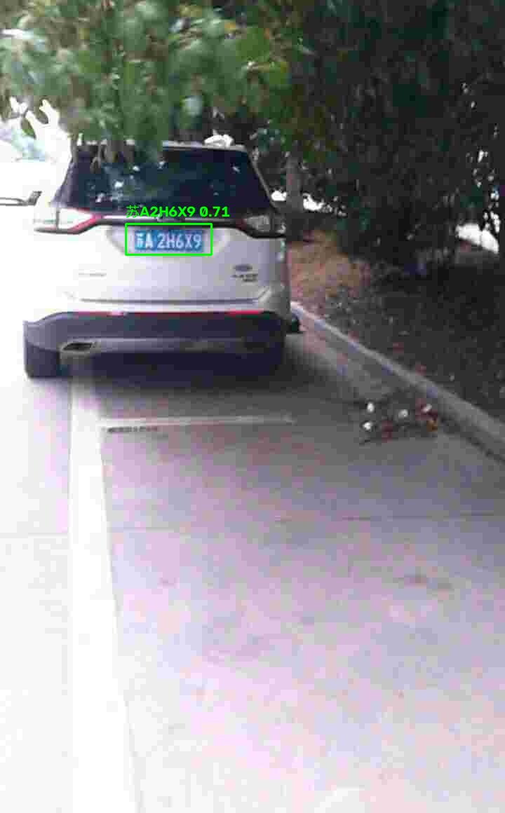
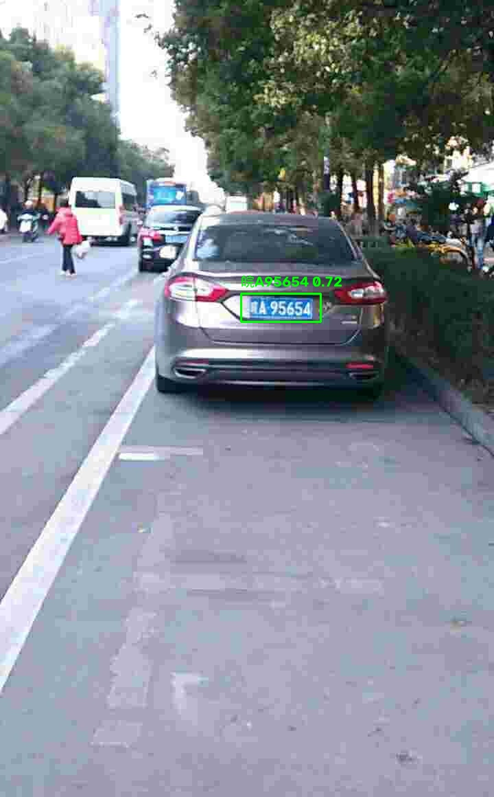
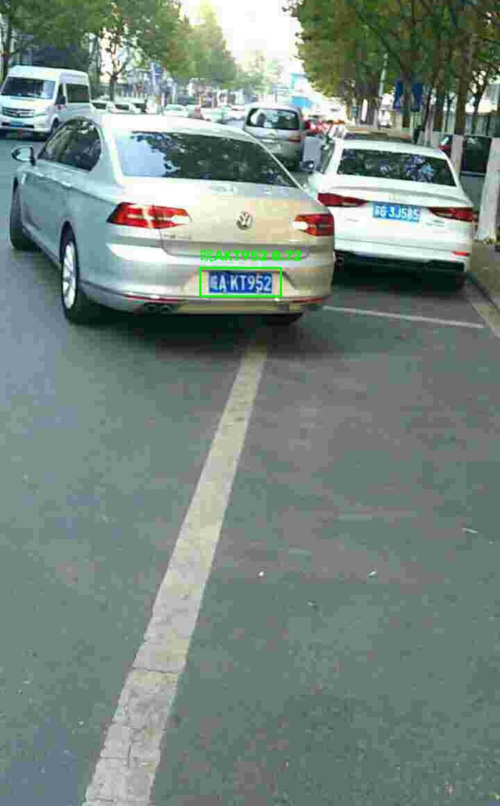
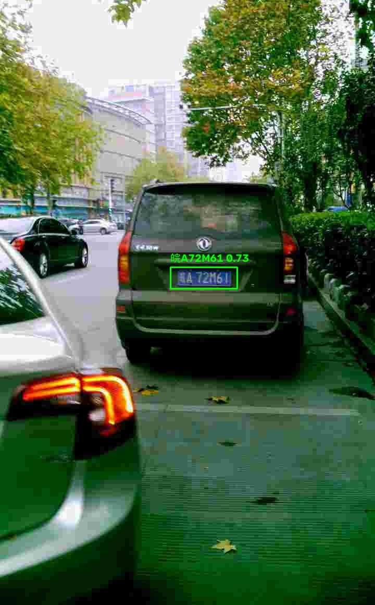
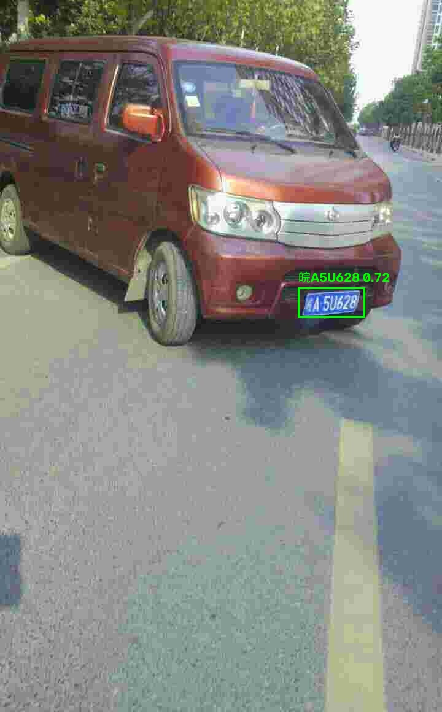
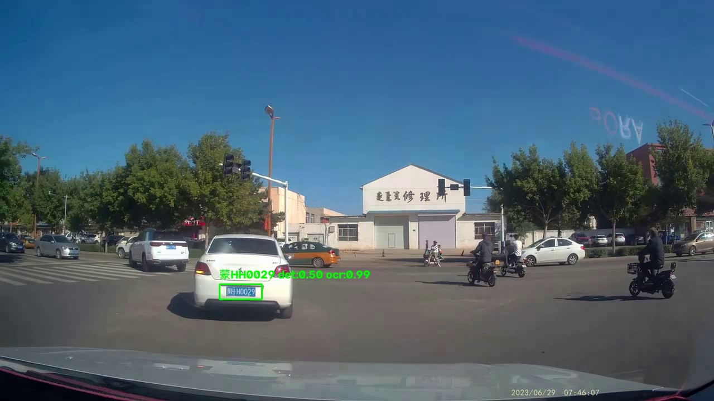

# 智能交通路口车牌识别升级项目

## 1. 项目简介
本项目面向智能交通路口管理场景，完成车牌识别算法的迭代升级。整体方案采用 `YOLOv11 + OCR` 两阶段流程：

- 第 1 阶段：使用 `YOLOv11` 完成车辆图像中的车牌检测与定位
- 第 2 阶段：使用 `OCR(CRNN + CTC)` 完成车牌字符识别
- 对比实验：补充完成 `LPRNet` 与 `PaddleOCR` 的同任务识别对比

项目目标是提升交通路口场景下的车牌定位精度、字符识别精度与整体响应速度，并形成可复现的训练、推理、评测与验收流程。

代码注释中已包含工单编号：`人工智能 CV-智能交通路口管理-车辆、行人目标检测与跟踪算法升级任务`。

## 2. 任务目标
本项目围绕以下需求实现：

- 车牌定位误差控制在 `10%` 以内
- 日间车牌字符识别准确率不低于 `95%`
- 夜间车牌字符识别准确率不低于 `90%`
- 从检测到输出识别结果的总响应时间不超过 `1 秒`
- 技术路线采用 `YOLOv11 车牌检测 + OCR 文字识别`

## 3. 技术路线
整体识别流程如下：

1. 输入车辆图像
2. 使用 `YOLOv11` 检测车牌位置
3. 根据检测框裁剪车牌区域
4. 将车牌裁剪图送入 OCR 识别模型
5. 输出完整车牌字符串
6. 统计检测、识别与响应时间指标

当前项目主要采用以下三条识别路线进行对比：

- 主方案：`OCR(CRNN + CTC)`
- 基线方案：`LPRNet`
- 第三方对照方案：`PaddleOCR`

## 4. 测试结果
### 4.1 验收结果摘要
来自 `acceptance_results/acceptance_summary.json` 的结果如下：

- 测试集总数：`3000`
- 车牌检测成功率：`1.0000`
- 整牌识别准确率：`0.9933`
- 平均字符准确率：`0.9988`
- 平均定位相对误差：`0.0344`
- 定位误差 `<= 10%` 占比：`0.9930`
- 平均总耗时：`39.09 ms`
- `P95` 总耗时：`49.95 ms`
- `1 秒内完成` 占比：`1.0000`

### 4.2 识别模型对比摘要
当前项目内三种识别方案的测试结果摘要如下：

- `OCR(CRNN + CTC)`：`exact_accuracy = 0.9923`
- `LPRNet`：`exact_accuracy = 0.9813`
- `PaddleOCR`：`acc = 0.9480`

当前项目中，`OCR(CRNN + CTC)` 是识别效果最好的方案，因此作为最终推荐识别模型。

### 4.3 效果可视化展示
为了让项目结果更直观，下面补充展示当前仓库中的实际推理效果图。

单张图片推理效果：



批量推理四宫格示例：

| 示例 1 | 示例 2 |
|---|---|
|  |  |
|  |  |

视频推理效果：

[点击查看视频推理结果](./video_infer_result.mp4)


视频推理测试结果：

| 指标 | 数值 |
|---|---:|
| 输入视频 | `1.mp4` |
| 输出视频 | `video_infer_result.mp4` |
| 处理起始帧 | 2000 |
| 处理帧数 | 300 |
| 检测到车牌的帧数 | 166 |
| 平均单帧耗时 | 68.01 ms |
| 多帧投票最高结果 | `蒙HH0029` |

视频结果预览帧：



说明：视频推理脚本已经加入车牌裁剪外扩、车牌小图增强、OCR 置信度过滤和多帧投票融合。部分 Markdown 预览器对 `.mp4` 的内嵌播放支持不稳定，所以这里使用 `video_infer_result.gif` 直接展示动态效果，同时保留 `video_infer_result.mp4` 作为完整视频结果文件。

## 5. 运行环境
### 5.1 建议环境
- 操作系统：`Windows 10/11` 或 `Linux`
- Python：`3.10`
- CUDA：有 NVIDIA GPU 时建议开启
- PyTorch：建议安装支持 CUDA 的版本

### 5.2 主要依赖
建议至少安装以下依赖：

```bash
pip install torch torchvision torchaudio
pip install ultralytics opencv-python numpy pandas matplotlib pillow tqdm pyyaml
```

如果需要运行 PaddleOCR 对比实验，还需要额外准备：

```bash
pip install paddlepaddle-gpu -i https://mirror.baidu.com/pypi/simple
pip install -r PaddleOCR-main/requirements.txt
```

说明：

- `YOLOv11` 检测训练与推理主要依赖 `ultralytics`
- 自研 OCR 与 LPRNet 训练主要依赖 `torch`
- PaddleOCR 对比实验依赖 `PaddleOCR-main`

## 6. 项目目录结构
```text
9-Sampling_of_CCPD_files
├─ acceptance_results/          # 项目验收结果，包含汇总指标和逐样本明细
├─ analysis/                    # 数据分析、模型对比分析、验收说明文档
├─ compare_ocr_results/         # OCR v1 与 OCR v2 对比结果
├─ cs/                          # PC/开发板 TensorRT 推理加速、导出和测速相关文件
├─ data/                        # YOLO 检测数据集，含 train/val/test 图像与标签
├─ infer_batch_results/         # 批量推理输出结果
├─ ocr/                         # 第一版 OCR 识别数据集
├─ ocr_v2/                      # 增强版 OCR 识别数据集
├─ paddleocr_output/            # PaddleOCR 训练输出结果
├─ paddleocr_rec/               # PaddleOCR 识别训练所需数据
├─ runs/                        # YOLOv11 检测训练结果
├─ runs_lprnet/                 # LPRNet 训练结果
├─ runs_ocr/                    # OCR v1 训练结果
├─ runs_ocr_v2/                 # OCR v2 训练结果
├─ scripts/                     # 项目主要执行脚本入口
├─ src/                         # 模型结构与工具函数源码
├─ video_debug_frames/          # 视频推理调试抽帧结果
├─ PaddleOCR-main/              # PaddleOCR 源码目录
├─ 1.mp4                        # 原始路口视频输入
├─ video_infer_result.mp4       # YOLOv11 + OCR 视频推理结果
├─ video_infer_result.gif       # README 中直接展示的视频推理动图
├─ video_infer_result_frame.jpg # 视频推理结果预览帧
├─ split_manifest.json          # 数据集切分记录
├─ yolo_ccpd.yaml               # YOLOv11 数据配置文件
├─ yolo11n.pt                   # YOLOv11 预训练权重
└─ README.md                    # 项目说明文档
```

## 7. 核心脚本说明
### 7.1 数据准备与分析
- `scripts/analyze_ccpd.py`
  用于分析 CCPD 数据集分布情况，输出 JSON 和 Markdown 摘要。
- `scripts/prepare_datasets.py`
  用于把原始 CCPD 图片整理为 YOLO 检测数据集和 OCR 识别数据集。
- `scripts/prepare_ocr_v2_dataset.py`
  用于生成增强版 OCR 数据集。
- `scripts/prepare_paddleocr_rec_dataset.py`
  用于将现有 OCR 数据转成 PaddleOCR 所需格式。

### 7.2 模型训练
- `scripts/train.py`
  训练 `YOLOv11` 车牌检测模型。
- `scripts/train_ocr.py`
  训练第一版 `OCR(CRNN + CTC)` 识别模型。
- `scripts/train_ocr_v2.py`
  训练增强版 `OCR(CRNN + CTC)` 识别模型。
- `scripts/train_lprnet.py`
  训练 `LPRNet` 基线识别模型。

### 7.3 推理与评测
- `scripts/infer_plate.py`
  对单张图片完成“检测 + 识别”完整推理。
- `scripts/infer_plate_batch.py`
  对多张图片进行批量推理，并输出统计结果。
- `scripts/infer_plate_video.py`
  对路口视频执行 YOLOv11 车牌检测和 OCR 识别，并通过车牌小图增强与多帧投票提升视频字符识别稳定性。
- `scripts/make_video_gif_preview.py`
  从视频推理结果中生成 GIF 动图，方便在 README 中直接展示视频效果。
- `scripts/extract_video_frames.py`
  从原始视频中抽取代表帧，用于检查视频内容和调试视频检测效果。
- `scripts/evaluate_recognizers.py`
  对 `OCR(CRNN + CTC)` 与 `LPRNet` 进行统一测试评估。
- `scripts/evaluate_acceptance.py`
  按项目验收口径输出检测、识别和响应时间结果。
- `scripts/compare_ocr_versions.py`
  对比 OCR v1 和 OCR v2 的识别表现。
- `cs/compare_speed.py`
  对比 `PyTorch` 与 `TensorRT` 引擎的推理速度，支持 PC 端 engine 和开发板端 engine。
- `cs/export_tensorrt.py`
  使用 Ultralytics 导出 TensorRT engine，适合在支持完整导出链路的设备上运行。
- `cs/build_engine_from_onnx.py`
  从 `best.onnx` 构建当前设备兼容的 TensorRT engine，本机 PC 端已使用该脚本生成 `yolo_best_pc.engine`。

## 8. 数据准备流程
### 8.1 原始数据集分析
在项目根目录下执行：

```bash
python scripts/analyze_ccpd.py --dataset-dir Sampling_of_CCPD_files --output-dir analysis
```

输出内容：

- `analysis/ccpd_summary.json`
- `analysis/ccpd_summary.md`

### 8.2 生成 YOLO 与 OCR 数据集
如果需要从原始 CCPD 图片重新生成训练数据，可以执行：

```bash
python scripts/prepare_datasets.py --dataset-dir Sampling_of_CCPD_files --output-dir .
```

执行后会生成或更新：

- `data/`
- `ocr/`
- `yolo_ccpd.yaml`
- `split_manifest.json`

### 8.3 生成增强版 OCR 数据集
如果需要增强 OCR 数据集，可以执行：

```bash
python scripts/prepare_ocr_v2_dataset.py
```

执行后会生成或更新：

- `ocr_v2/`

## 9. 训练流程
### 9.1 训练 YOLOv11 车牌检测模型
```bash
python scripts/train.py
```

默认输出目录：

- `runs/detect/train/`

核心权重文件：

- `runs/detect/train/weights/best.pt`

### 9.2 训练 OCR v1 模型
```bash
python scripts/train_ocr.py
```

默认输出目录：

- `runs_ocr/`

核心权重文件：

- `runs_ocr/best.pt`

### 9.3 训练 OCR v2 模型
```bash
python scripts/train_ocr_v2.py
```

默认输出目录：

- `runs_ocr_v2/`

核心权重文件：

- `runs_ocr_v2/best.pt`

### 9.4 训练 LPRNet 基线模型
```bash
python scripts/train_lprnet.py
```

默认输出目录：

- `runs_lprnet/`

核心权重文件：

- `runs_lprnet/best.pt`

### 9.5 训练 PaddleOCR 对照模型
PaddleOCR 训练在 `PaddleOCR-main/` 目录中执行，配置文件采用项目内准备好的车牌识别配置。

训练完成后，结果通常输出到：

- `paddleocr_output/plate_rec/`

## 10. 推理与测试
### 10.1 单张图片推理
```bash
python scripts/infer_plate.py
```

默认行为：

- 自动读取测试图片
- 自动加载 `runs/detect/train/weights/best.pt`
- 自动加载 `runs_ocr_v2/best.pt`
- 输出结果图片到 `infer_result.jpg`

当前单张推理结果文件：

- `infer_result.jpg`

推理效果示意图：


### 10.2 批量图片推理
```bash
python scripts/infer_plate_batch.py
```

默认输出目录：

- `infer_batch_results/images/`
- `infer_batch_results/batch_results.csv`
- `infer_batch_results/batch_summary.json`

当前批量推理统计结果如下：

| 指标 | 数值 |
|---|---:|
| 测试图片数 | 50 |
| 检测成功数 | 50 |
| 检测成功率 | 1.0000 |
| 整牌识别正确数 | 49 |
| 整牌识别准确率 | 0.9800 |
| 平均字符准确率 | 0.9971 |

结果来源：`infer_batch_results/batch_summary.json`

### 10.3 视频推理测试
```bash
python scripts/infer_plate_video.py
```

默认输入与输出：

- 输入视频：`1.mp4`
- 输出视频：`video_infer_result.mp4`
- 预览动图：`video_infer_result.gif`
- 预览帧：`video_infer_result_frame.jpg`

当前视频推理结果如下：

| 指标 | 数值 |
|---|---:|
| 处理起始帧 | 2000 |
| 处理帧数 | 300 |
| 检测到车牌的帧数 | 166 |
| 平均单帧耗时 | 68.01 ms |
| 多帧投票最高结果 | `蒙HH0029` |

说明：该视频来自行车记录仪视角，车牌目标相对较小，因此视频推理脚本中使用了 `imgsz=1280` 来提升小车牌检测效果。同时脚本对车牌裁剪图做了边距外扩、对比度增强、锐化处理，并使用多帧投票减少单帧模糊造成的字符跳变。

如需重新生成 README 中展示的 GIF：

```bash
python scripts/make_video_gif_preview.py
```

### 10.4 OCR 与 LPRNet 统一评测
```bash
python scripts/evaluate_recognizers.py
```

默认输出文件：

- `analysis/recognizer_compare_summary.json`

当前统一测试结果如下：

| 模型 | 测试样本数 | 整牌准确率 | 字符准确率 |
|---|---:|---:|---:|
| OCR(CRNN + CTC) | 3000 | 0.9923 | 0.9987 |
| LPRNet | 3000 | 0.9813 | 0.9890 |

补充的 PaddleOCR 对照结果如下：

| 模型 | 测试样本数 | 整牌准确率 | 备注 |
|---|---:|---:|---|
| PaddleOCR | 3000 | 0.9480 | 指标口径为 PaddleOCR 自带评测 `acc` |

结果来源：

- `analysis/recognizer_compare_summary.json`
- `analysis/OCR、LPRNet与PaddleOCR对比分析.md`

### 10.5 项目验收评测
```bash
python scripts/evaluate_acceptance.py
```

默认输出文件：

- `acceptance_results/acceptance_details.csv`
- `acceptance_results/acceptance_summary.json`

当前验收结果如下：

| 指标 | 数值 |
|---|---:|
| 测试集总数 | 3000 |
| 检测成功数 | 3000 |
| 检测成功率 | 1.0000 |
| 整牌识别正确数 | 2980 |
| 整牌识别准确率 | 0.9933 |
| 平均字符准确率 | 0.9988 |
| 平均 IoU | 0.8772 |
| 中位数 IoU | 0.8880 |
| 平均定位相对误差 | 0.0344 |
| 定位误差 <= 10% 占比 | 0.9930 |
| 平均检测耗时 | 27.41 ms |
| 平均 OCR 耗时 | 11.18 ms |
| 平均总耗时 | 39.09 ms |
| P95 总耗时 | 49.95 ms |
| 1 秒内完成占比 | 1.0000 |

按亮度近似分组的结果如下：

| 场景分组 | 图片数 | 整牌准确率 | 平均字符准确率 |
|---|---:|---:|---:|
| day_proxy | 1572 | 0.9943 | 0.9991 |
| night_proxy | 1428 | 0.9923 | 0.9984 |

结果来源：`acceptance_results/acceptance_summary.json`

## 11. TensorRT 加速测速
本项目的推理加速按老师要求分成两部分：`PC 端加速测试` 和 `开发板端加速测试`。

### 11.1 PC 端加速测试
PC 端已经完成以下内容：

- 删除旧的、不兼容的 TensorRT engine：`yolo_best_fp16.engine`、`yolo_best_int8.engine`
- 导出 ONNX 中间模型：`cs/best.onnx`
- 基于当前 PC 的 TensorRT 11 环境重新构建 engine：`cs/yolo_best_pc.engine`
- 使用 `cs/compare_speed.py` 完成 PyTorch 与 TensorRT 的测速对比

PC 端重新导出 TensorRT engine 的命令如下：

```bash
python cs/build_engine_from_onnx.py
```

PC 端测速命令如下：

```bash
python cs/compare_speed.py
```

当前 PC 端实测结果如下：

| 模型 | 平均耗时 | FPS | 说明 |
|---|---:|---:|---|
| PyTorch `.pt` | 30.675 ms | 32.60 | `cs/best.pt` |
| TensorRT engine | 23.360 ms | 42.81 | `cs/yolo_best_pc.engine` |

PC 端加速效果：

| 指标 | 数值 |
|---|---:|
| 单帧耗时降低 | 7.315 ms |
| 速度提升倍数 | 1.31x |
| FPS 提升 | 10.21 |

### 11.2 开发板端加速测试
开发板端不能直接使用 PC 端生成的 `.engine` 文件，因为 TensorRT engine 与 GPU 架构、TensorRT 版本、CUDA 版本强相关。开发板上必须重新生成自己的 engine。

开发板需要上传或保留的文件：

- `cs/best.pt`
- `cs/best.onnx`
- `cs/build_engine_from_onnx.py`
- `cs/compare_speed.py`
- `cs/02-92_88-268&513_509&595-507&596_264&588_269&514_512&522-0_0_5_26_31_31_19-100-45.jpg`

开发板端推荐流程：

```bash
cd 项目根目录
python cs/build_engine_from_onnx.py
```

开发板端生成后，将输出的 engine 文件改名为：

```text
cs/yolo_best_board.engine
```

然后运行：

```bash
python cs/compare_speed.py
```

开发板端需要记录以下结果：

| 平台 | 模型 | 平均耗时 | FPS | 结果文件 |
|---|---|---:|---:|---|
| 开发板 | PyTorch `.pt` | 待实测 | 待实测 | `cs/pt_model.jpg` |
| 开发板 | TensorRT engine | 待实测 | 待实测 | `cs/trt_board.jpg` |

### 11.3 当前文件说明
该部分相关文件统一放在 `cs/`：

- `best.pt`：YOLOv11 检测模型原始 PyTorch 权重
- `best.onnx`：ONNX 中间模型
- `yolo_best_pc.engine`：本机 PC 端重新构建的 TensorRT engine
- `yolo_best_board.engine`：开发板端重新构建后建议使用的文件名
- `compare_speed.py`：PC/开发板通用测速脚本
- `build_engine_from_onnx.py`：ONNX 转 TensorRT engine 脚本
- `pt_model.jpg`：PyTorch 推理可视化结果
- `trt_pc.jpg`：PC 端 TensorRT 推理可视化结果

## 12. 结果文件说明
项目中最重要的结果文件如下：

- `runs/detect/train/weights/best.pt`
  YOLOv11 车牌检测最优权重。
- `runs_ocr_v2/best.pt`
  当前推荐使用的 OCR 最优识别权重。
- `runs_lprnet/best.pt`
  LPRNet 对照实验最优权重。
- `acceptance_results/acceptance_summary.json`
  项目验收核心指标汇总。
- `analysis/recognizer_compare_summary.json`
  OCR 与 LPRNet 的统一测试对比结果。
- `analysis/OCR、LPRNet与PaddleOCR对比分析.md`
  三种识别路线的对比分析文档。
- `analysis/项目验收说明.md`
  按项目需求整理的验收结论说明。
- `video_infer_result.mp4`
  路口视频经过 YOLOv11 检测和 OCR 识别后的完整结果视频。
- `video_infer_result.gif`
  从视频结果中抽取生成的动图预览，主要用于 README 直接展示。
- `video_infer_result_frame.jpg`
  视频推理结果的单帧预览图。
- `cs/yolo_best_pc.engine`
  当前 PC 端重新构建并测试通过的 TensorRT engine。
- `cs/best.onnx`
  TensorRT 构建使用的 ONNX 中间模型。

## 13. GitHub 上传建议
如果要将本项目上传到 GitHub，建议：

### 13.1 建议上传
- `scripts/`
- `src/`
- `analysis/`
- `cs/` 中的脚本与说明文件
- `README.md`
- `yolo_ccpd.yaml`
- 适量示例图片与示例结果

### 13.2 不建议直接上传
- 大体积原始数据集
- 大量训练结果图片
- 大模型权重文件
- 第三方完整源码目录（如 `PaddleOCR-main/`）

如果确实需要保留权重文件，建议使用：

- GitHub Release
- Git LFS
- 网盘或对象存储下载链接

## 14. 当前推荐使用方式
如果只保留一条主流程，推荐如下：

1. 使用 `YOLOv11` 检测模型：`runs/detect/train/weights/best.pt`
2. 使用 OCR 识别模型：`runs_ocr_v2/best.pt`
3. 单张演示运行：`python scripts/infer_plate.py`
4. 视频演示运行：`python scripts/infer_plate_video.py`
5. PC 端加速测速：`python cs/compare_speed.py`
6. 批量评测运行：`python scripts/evaluate_acceptance.py`

## 15. 后续可继续优化方向
- 补充更多省份、更多特殊车牌类型的数据
- 补充明确的白天/夜间标注测试集
- 补充雨天、逆光、遮挡、模糊等复杂场景样本
- 对 OCR 识别模型继续做更大规模数据增强
- 对部署端继续推进 TensorRT 加速落地
